# Translation Management Service – Implementation Plan

## Development Phases (Step-by-Step)

Execute in order; each phase builds on the previous. Test and validate at the end of each phase before moving on.

```mermaid
flowchart LR
  subgraph phase1 [Phase 1]
    P1[Foundation]
  end
  subgraph phase2 [Phase 2]
    P2[Schema and Models]
  end
  subgraph phase3 [Phase 3]
    P3[Locales and Tags API]
  end
  subgraph phase4 [Phase 4]
    P4[Translations CRUD and Search]
  end
  subgraph phase5 [Phase 5]
    P5[Export and Performance]
  end
  subgraph phase6 [Phase 6]
    P6[Auth and Security]
  end
  subgraph phase7 [Phase 7]
    P7[Scalability and 100k Seeder]
  end
  subgraph phase8 [Phase 8]
    P8[OpenAPI CDN README]
  end
  subgraph phase9 [Phase 9]
    P9[Testing and Coverage]
  end
  P1 --> P2 --> P3 --> P4 --> P5 --> P6 --> P7 --> P8 --> P9
```



**Phase summary**

| Phase | Focus | Key deliverables |
|-------|--------|-------------------|
| 1 | Foundation | Laravel, Docker, PSR-12, folder structure |
| 2 | Schema and models | Migrations, indexes, Eloquent models, basic seeders |
| 3 | Locales and tags API | CRUD endpoints, validation, JSON envelope |
| 4 | Translations CRUD and search | Create/update/delete, search by tag/key/content, pagination |
| 5 | Export and performance | JSON export, cache invalidation, &lt; 500ms, CDN headers |
| 6 | Auth and security | Sanctum, protected routes, throttle, policies |
| 7 | Scalability | 100k+ seeder command, performance validation |
| 8 | OpenAPI, CDN, README | API docs, CDN notes, setup and design README |
| 9 | Testing and coverage | Unit, feature, performance tests; &gt; 95% coverage |

---

### Phase 1: Foundation (Day 1)

**Goal:** Runnable Laravel app in Docker with standards enforced.

| Step | Task | Output |
|------|------|--------|
| 1.1 | Create fresh Laravel 11 project; PHP 8.2+ | `composer.json`, app skeleton |
| 1.2 | Add `Dockerfile` (PHP-FPM + Nginx or PHP built-in) and `docker-compose.yml` (app, MySQL, Redis) | Containers run, `.env` for DB/Redis |
| 1.3 | Add `phpcs.xml` / PHP-CS-Fixer config for PSR-12 | `composer.json` scripts: `lint`, `fix` |
| 1.4 | Create folder structure: `app/Http/Controllers/Api`, `app/Services`, `app/Models` | Empty namespaces ready |
| 1.5 | Configure CORS, logging, and base API route prefix | `config/cors.php`, `routes/api.php` with `/api/v1` |

**Done when:** `docker-compose up` runs app; `composer lint` passes.

---

### Phase 2: Database Schema and Models (Day 2)

**Goal:** All tables, indexes, and Eloquent models in place; no API yet.

| Step | Task | Output |
|------|------|--------|
| 2.1 | Migration: `locales` (id, code, name); unique on `code` | `create_locales_table` |
| 2.2 | Migration: `tags` (id, name); unique on `name` | `create_tags_table` |
| 2.3 | Migration: `translation_keys` (id, key); unique on `key` | `create_translation_keys_table` |
| 2.4 | Migration: `translations` (id, translation_key_id, locale_id, value, timestamps); unique (translation_key_id, locale_id); indexes (locale_id, translation_key_id), (updated_at) | `create_translations_table` |
| 2.5 | Migration: `translation_tag` pivot (translation_id, tag_id); indexes on both FKs | `create_translation_tag_table` |
| 2.6 | Add full-text or search index on `translations.value` and/or `translation_keys.key` (MySQL FULLTEXT or PostgreSQL equivalent) | Migration or separate migration |
| 2.7 | Eloquent models: `Locale`, `Tag`, `TranslationKey`, `Translation` with relationships and fillable | `app/Models/*.php` |
| 2.8 | Basic seeders: a few locales (en, fr, es), tags (mobile, desktop, web) | `database/seeders/*` |

**Done when:** `php artisan migrate --seed` runs; models load relations without N+1 in Tinker.

---

### Phase 3: Locales and Tags API (Day 3)

**Goal:** CRUD for locales and tags; no auth yet (or simple auth placeholder).

| Step | Task | Output |
|------|------|--------|
| 3.1 | Form Requests: `StoreLocaleRequest`, `UpdateLocaleRequest`; same for Tag | Validation rules, PSR-12 |
| 3.2 | `LocaleController`: index, store, show, update, destroy; inject a small service or use model directly | `GET/POST /locales`, `GET/PUT/DELETE /locales/{id}` |
| 3.3 | `TagController`: index, store, show, update, destroy | `GET/POST /tags`, `GET/PUT/DELETE /tags/{id}` |
| 3.4 | Register routes under `api/v1`; consistent JSON envelope for list (data + meta) | `routes/api.php` |
| 3.5 | Optional: Resource classes for consistent JSON shape | `app/Http/Resources/*` |

**Done when:** All locale and tag endpoints return correct JSON; validation returns 422 on invalid input.

---

### Phase 4: Translations CRUD and Search (Day 4)

**Goal:** Full CRUD for translations; search by tag, locale, key, content; pagination; &lt; 200ms target.

| Step | Task | Output |
|------|------|--------|
| 4.1 | Form Requests: `StoreTranslationRequest`, `UpdateTranslationRequest` (key or translation_key_id, locale_id, value, tag_ids) | Validation, exists rules |
| 4.2 | `TranslationService`: create, update, delete; resolve or create `TranslationKey` by key string; sync tags | `app/Services/TranslationService.php` |
| 4.3 | `TranslationSearchService` or scopes: filter by tag, locale, key, content (use indexes/full-text); eager load relations; paginate | Single optimized query, no N+1 |
| 4.4 | `TranslationController`: index (with filters), store, show, update, destroy | All translation endpoints |
| 4.5 | Register routes; add indexes if search is slow | List and filters return in &lt; 200ms with 10k rows (early check) |

**Done when:** Create, read, update, delete, and search (by tag, key, content) work; response times logged.

---

### Phase 5: JSON Export and Performance (Day 5)

**Goal:** Export endpoint returns up-to-date JSON for frontend; cache invalidation; &lt; 500ms for large dataset.

| Step | Task | Output |
|------|------|--------|
| 5.1 | Define export format (e.g. nested by locale: `{ "en": { "auth": { "login": "..." } } }`) | Contract in README or OpenAPI later |
| 5.2 | `TranslationExportService`: build structure from DB; one query per locale (or one joined query); use indexes | Method returns array by locale |
| 5.3 | `ExportController`: GET `/api/v1/export?locale=en` or all locales; use `Cache::remember()` with key per locale; Redis driver | Response JSON |
| 5.4 | Invalidate cache on translation create/update/delete (observer or in `TranslationService`): `Cache::forget("export.{$locale}")` for affected locales | Always-updated guarantee |
| 5.5 | Add CDN-friendly headers on export: `Cache-Control`, optional `ETag` / `Last-Modified` | Export response headers |
| 5.6 | Tune query and cache so export with 50k+ rows returns in &lt; 500ms | Optional: simple benchmark script |

**Done when:** Export returns correct structure; updating a translation and re-calling export shows new value; timing &lt; 500ms.

---

### Phase 6: Authentication and Security (Day 6)

**Goal:** Token-based auth; all endpoints except export protected; validation and security best practices.

| Step | Task | Output |
|------|------|--------|
| 6.1 | Install and configure Laravel Sanctum; migrations | `config/sanctum.php` |
| 6.2 | User model and migration if not present; add `HasApiTokens` | Users can hold tokens |
| 6.3 | Auth routes: login (issue token), logout (revoke); or token creation via UI/artisan | POST login returns token |
| 6.4 | Apply `auth:sanctum` middleware to all API routes except `export` and health | 401 on protected routes without token |
| 6.5 | Add throttle middleware (e.g. 60 requests/minute per user) | `Route::middleware(['throttle:60,1'])` |
| 6.6 | Policies or middleware for authorization (e.g. only admin can create locales/tags); optional role flag on User | 403 where applicable |
| 6.7 | Review CORS, validation messages (no sensitive data), and ensure no raw SQL with user input | Security checklist done |

**Done when:** All CRUD and search require valid Bearer token; export is public; throttle and CORS configured.

---

### Phase 7: Scalability and 100k+ Seeder (Day 7)

**Goal:** Command and factories to populate 100k+ records; list and export still within performance targets.

| Step | Task | Output |
|------|------|--------|
| 7.1 | Factories: `LocaleFactory`, `TagFactory`, `TranslationKeyFactory`, `TranslationFactory` | Realistic fake data |
| 7.2 | Artisan command: `translations:seed-large --count=100000` | Chunked bulk insert (e.g. 1000 per chunk); create keys/locales/tags first, then translations and pivots |
| 7.3 | Use `DB::table()->insert()` for bulk translation rows where possible; batch pivot inserts | Command completes in reasonable time (e.g. &lt; 5 min) |
| 7.4 | Re-run performance check: list with filters &lt; 200ms, export &lt; 500ms with 100k rows | Tune indexes or query if needed |
| 7.5 | Document in README: how to run the seeder and expected timings | README section |

**Done when:** `php artisan translations:seed-large --count=100000` succeeds; list and export meet timing targets.

---

### Phase 8: OpenAPI, CDN, and README (Day 8)

**Goal:** API docs, CDN guidance, and clear setup/design README.

| Step | Task | Output |
|------|------|--------|
| 8.1 | Install L5-Swagger or Scramble; generate OpenAPI 3 from routes and Form Requests | `config/l5-swagger.php` or Scramble config |
| 8.2 | Document all endpoints (request/response examples, query params, 401/422/500) | `/api/documentation` or `/docs` |
| 8.3 | Add README section for CDN: export URL, recommended headers, purge on deploy or on translation update | README |
| 8.4 | README: project overview, design choices (schema, cache invalidation, SOLID), setup (env, Docker, migrate, seed, run tests) | Full README |

**Done when:** OpenAPI UI loads; README allows a new developer to run the app and tests.

---

### Phase 9: Testing and Coverage (Day 9–10)

**Goal:** Unit, feature, and performance tests; coverage &gt; 95% for critical code.

| Step | Task | Output |
|------|------|--------|
| 9.1 | PHPUnit config: coverage thresholds (e.g. 95% for `app/Services`, `app/Http/Controllers/Api`, `app/Models`) | `phpunit.xml` |
| 9.2 | Unit tests: `TranslationService`, `TranslationExportService`, `TranslationSearchService` (mock DB or use RefreshDatabase with minimal data) | `tests/Unit/Services/*` |
| 9.3 | Feature tests: auth (login, token, 401); locales and tags CRUD; translations CRUD and search (filters, pagination); export (structure, cache invalidation) | `tests/Feature/Api/*` |
| 9.4 | Performance tests: list endpoint &lt; 200ms, export &lt; 500ms with 100k seeded DB (mark as performance suite, run in CI with seed) | `tests/Feature/Api/Performance*` or `tests/Performance/*` |
| 9.5 | Run coverage; add tests until &gt; 95% for target directories | `phpunit --coverage-text` |

**Done when:** All tests pass; coverage &gt; 95%; performance tests green in CI with 100k dataset.

---

## Reference: Detailed Specifications (unchanged)

## 1. Project Setup and Standards

- **Laravel**: Fresh Laravel 11.x install; PHP 8.2+.
- **PSR-12**: Enforce via `phpcs.xml` / `php-cs-fixer` and CI; no external CRUD/translation libraries (use Eloquent/Query Builder only).
- **Docker**: `Dockerfile` (PHP-FPM + Nginx or single PHP image) and `docker-compose.yml` with app, MySQL/PostgreSQL, Redis (for cache/sessions). Optional `docker-compose.test.yml` for test DB.
- **Structure**: Feature-based organization under `app/Http/Controllers/Api`, `app/Services`, `app/Repositories` (or Actions), `app/Models`; DTOs where useful for request/response shaping.

---

## 2. Database Schema (Scalable)

Target: multiple locales, tags, and 100k+ translation rows with sub-200ms reads and sub-500ms export.

**Tables:**

| Table | Purpose |
|-------|--------|
| `locales` | `id`, `code` (en, fr, es), `name`; unique on `code`. |
| `tags` | `id`, `name` (mobile, desktop, web); unique on `name`. |
| `translation_keys` | `id`, `key` (e.g. `auth.login`); unique on `key`. Normalize key to avoid duplication. |
| `translations` | `id`, `translation_key_id`, `locale_id`, `value` (TEXT), `updated_at`. Composite unique `(translation_key_id, locale_id)`. |
| `translation_tag` | Pivot: `translation_id`, `tag_id`; composite primary key. |

**Indexes for performance:**

- `translations`: index on `(locale_id, translation_key_id)`, index on `updated_at` (for "always fresh" export).
- `translation_tag`: indexes on `translation_id`, `tag_id`.
- Full-text (or trigram) index on `translations.value` and/or `translation_keys.key` for search by content/keys (DB-dependent: MySQL FULLTEXT or PostgreSQL `gin(to_tsvector(...))`).

**Migrations:** One migration per table; foreign keys and indexes in same migration or follow-up. Use `Schema::` only (no external packages).

---

## 3. API Design and Endpoints

**Base path:** `/api/v1` (or `/api` with version in header). All responses JSON; consistent envelope: `{ "data": ..., "meta": ... }` for lists.

**Auth:** Token-based (Laravel Sanctum): `Authorization: Bearer <token>`. Public: only JSON export (and optionally health). Rest protected.

| Method | Endpoint | Purpose |
|--------|----------|--------|
| POST | `/locales` | Create locale (admin). |
| GET | `/locales` | List locales. |
| POST | `/tags` | Create tag. |
| GET | `/tags` | List tags. |
| POST | `/translations` | Create translation (key + locale + value + tag IDs). |
| GET | `/translations` | List with pagination; filter by `tag`, `locale`, `key`, `content` (search). |
| GET | `/translations/{id}` | Single translation. |
| PUT/PATCH | `/translations/{id}` | Update translation. |
| DELETE | `/translations/{id}` | Delete translation. |
| GET | `/export` or `/export/{locale?}` | **JSON export** for frontend (e.g. Vue i18n shape). No auth or read-only token; must reflect latest data. |

**Search:** Query params: `tag`, `locale`, `key`, `content`. Use indexed columns and full-text/trigram on `value`/`key`; avoid N+1 (eager load `translationKey`, `locale`, `tags`).

**JSON export contract:**

Return a flat or nested object by locale, e.g. `{ "en": { "auth": { "login": "Login" } }, "fr": { ... } }`. Single locale: `?locale=en`. Response &lt; 500ms for large datasets (see caching and query strategy below).

---

## 4. Performance Strategy (< 200ms / < 500ms)

- **Indexes:** As above; no full table scans on hot paths.
- **Queries:** Single query for list with filters; eager load relations in one go; select only needed columns.
- **Export endpoint:**  
  - Option A: Dedicated "export" table or materialized view updated by observers/jobs on translation change.  
  - Option B: Single aggregated query per locale (e.g. `translation_keys.key` + `translations.value` grouped by locale) with strict index use; optional short TTL cache (e.g. 60s) with cache invalidation on write, and document "always updated" as "within TTL or on next request after write".  

Prefer B with cache invalidation on create/update/delete so "always return updated" is satisfied when cache is invalidated; TTL can be 0 or very short.

- **Caching:** Redis for export response (key per locale); invalidate on any translation change for that locale. Use `Cache::remember()` with tags or explicit keys per locale.
- **Pagination:** Cursor or offset; limit page size (e.g. 50) to keep list endpoint &lt; 200ms.
- **No N+1:** All list/detail endpoints use `with()` for relations; export uses one query per locale or one joined query.

---

## 5. Security (Token-Based, Best Practices)

- **Laravel Sanctum:** API token authentication for all endpoints except export (and health).
- **Middleware:** `auth:sanctum` on all routes except export; optional `throttle:60,1` per user.
- **Validation:** Form Requests for create/update (key, locale_id, value, tag_ids); max lengths, exists rules for FKs.
- **Authorization:** Policy or middleware so only authorized users can create/update/delete (e.g. by role or "admin" flag if you add users table).
- **Headers:** CORS config for frontend origin; no sensitive data in error messages.
- **SQL:** Eloquent/Query Builder only; bindings only (no raw user input in SQL).

---

## 6. 100k+ Records for Scalability Testing

- **Factory:** `TranslationFactory` (and `TranslationKeyFactory`, `LocaleFactory`, `TagFactory`) using `Translation::factory()->count(n)` with realistic keys/values.
- **Command:** e.g. `php artisan translations:seed-large {--count=100000}`. In command: chunk inserts (e.g. 1000 per chunk) and use `DB::transaction()` per chunk to avoid one huge transaction; create locales/tags/keys first, then translations and pivots. Optionally dispatch a job to run in background.
- **Optimization:** Use `insert()` for bulk (e.g. translation_key_id, locale_id, value) instead of creating models one-by-one where possible; keep pivot inserts batched.

---

## 7. JSON Export and "Always Updated"

- **Contract:** GET `/api/v1/export?locale=en` (or all locales). Response: nested or flat key-value by locale.
- **Implementation:** Build structure from DB (keys + values for requested locale(s)); single query per locale with indexes; then cache with invalidation on write.
- **Always updated:** On create/update/delete of any translation, invalidate cache for affected locale(s) (e.g. `Cache::forget("export.{$locale}")` or tags). No long TTL without invalidation so "whenever requested" returns latest data after a short delay (or immediately if no cache).
- **Large datasets:** Rely on indexed query + optional streaming (e.g. `StreamedResponse` with `json_encode` chunked) only if needed; primary lever is efficient query + Redis cache so response &lt; 500ms.

---

## 8. CDN Support (Plus)

- **Headers:** `Cache-Control`, `ETag`, and/or `Last-Modified` on export endpoint. Short max-age (e.g. 0 or 60) with must-revalidate; or no-store with ETag/304.
- **Documentation:** README to state that the export URL can be put behind CDN; recommend cache invalidation (purge) on deployment or via webhook when translations are updated (e.g. call CDN purge API from observer/job).
- **Optional:** Config value for "export base URL" so frontend can point to CDN URL.

---

## 9. OpenAPI / Swagger (Plus)

- **Tool:** Use `L5-Swagger` (OpenAPI 3) or `Scramble` (annotation-based) to generate spec from routes and Form Requests.
- **Coverage:** Document all API endpoints, request bodies, query params, responses (200, 401, 422, 500). Add example responses for export and list.
- **Serve:** `/api/documentation` or `/docs` behind auth or allow in `App\Providers\RouteServiceProvider` / `routes/api.php`.

---

## 10. Testing (> 95% Coverage, Unit + Feature + Performance)

- **Unit:** Services (e.g. export builder, search filter builder), value objects, validation logic. Mock DB where appropriate.
- **Feature:**  
  - Auth: login, token creation, protected route 401.  
  - CRUD: create/update/delete/list translations, locales, tags; search by tag, key, content; pagination.  
  - Export: GET export for one locale and all locales; verify structure and that updated translation appears (invalidate cache then GET).
- **Performance:**  
  - PHPUnit test that runs list endpoint with 100k records and asserts response time &lt; 200ms (or 500ms for export); use `$this->assertLessThan(200, $ms)`.  
  - Optional: dedicated "performance" test suite (e.g. `tests/Performance`) run in CI with seeded 100k DB.
- **Target:** > 95% line/branch coverage for `app/Services`, `app/Http/Controllers/Api`, `app/Models`, and route handlers; exclude trivial config and providers.

---

## 11. SOLID and Code Quality

- **Single responsibility:** Controllers thin (validate → call service → return JSON); business logic in `App\Services\TranslationService`, `ExportService`, `SearchService`.
- **Open/closed:** Prefer interfaces for export format (e.g. `TranslationExportInterface`) so new formats (e.g. nested vs flat) can be added without changing existing code.
- **Liskov:** Any implementation of export interface returns valid structure.
- **Interface segregation:** Small interfaces (e.g. `ExportsTranslations`, `SearchesTranslations`) if multiple implementations exist.
- **Dependency injection:** Services injected in controllers and commands; repositories or actions injected into services; use Laravel container.
- **No external CRUD/translation libs:** Use only Eloquent, Query Builder, and Laravel's validation/sanctum.

---

## 12. Deliverables Checklist

- [ ] Laravel app with PSR-12 and Docker (Dockerfile + docker-compose).
- [ ] Migrations for locales, tags, translation_keys, translations, translation_tag with indexes.
- [ ] Sanctum token auth; protected routes; Form Request validation.
- [ ] CRUD + search (tag, key, content) for translations; CRUD for locales/tags as needed.
- [ ] JSON export endpoint (updated on every request via cache invalidation); &lt; 500ms.
- [ ] All endpoints &lt; 200ms (list, get, create, update, delete) with 100k data.
- [ ] Command/factory to seed 100k+ translations; optimized bulk insert.
- [ ] OpenAPI/Swagger for all API endpoints.
- [ ] CDN-oriented headers and README note for export URL.
- [ ] Unit + feature + performance tests; coverage &gt; 95%.
- [ ] README: setup (env, migrate, seed, Docker), design choices (schema, cache, SOLID), and how to run tests.

---

## 13. Suggested File Layout (High Level)

```
app/
  Http/Controllers/Api/
    LocaleController.php
    TagController.php
    TranslationController.php
    ExportController.php
  Services/
    TranslationService.php
    TranslationExportService.php
    TranslationSearchService.php
  Models/
    Locale.php, Tag.php, TranslationKey.php, Translation.php
  Actions/ or Repositories/ (optional)
database/
  migrations/ (locales, tags, translation_keys, translations, translation_tag)
  factories/
  seeders/
routes/
  api.php (v1 routes)
config/
  sanctum.php, cache
tests/
  Unit/Services/...
  Feature/Api/...
  Performance/ (optional)
docker-compose.yml, Dockerfile
phpunit.xml (coverage thresholds)
```

---

## 14. Risk and Scope Notes

- **"Always updated" vs &lt; 500ms:** Achieved by cache invalidation on every write plus efficient query; avoid long TTL without invalidation.
- **100k in &lt; 200ms:** Requires indexes, one query, no N+1; if 200ms is tight, consider read replica or dedicated index (e.g. search index) in a later phase.
- **No external libraries for CRUD/translation:** Use only Laravel + Sanctum + optional L5-Swagger/Scramble; no extra translation packages for the core service.

This plan satisfies the task requirements, performance targets, technical and plus-point deliverables, and aligns with the stated evaluation weights (code quality, scalability, API design, security, testing).
